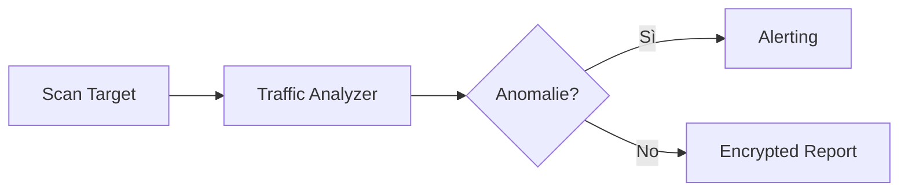

<div align="center">

```
    ██████╗ ██╗███████╗██████╗  ██████╗ ███████╗████████╗
    ██╔══██╗██║██╔════╝██╔══██╗██╔═══██╗██╔════╝╚══██╔══╝
    ██████╔╝██║█████╗  ██████╔╝██║   ██║███████╗   ██║   
    ██╔══██╗██║██╔══╝  ██╔══██╗██║   ██║╚════██║   ██║   
    ██████╔╝██║██║     ██║  ██║╚██████╔╝███████║   ██║   
    ╚═════╝ ╚═╝╚═╝     ╚═╝  ╚═╝ ╚═════╝ ╚══════╝   ╚═╝   
```

### **Asgard Cybersecurity Suite** &mdash; Module III

<br/>


<br/>

> [!IMPORTANT]
> **Bifrost** è il terzo pilastro della **suite Asgard**. 
> Fornisce una visibilità totale sulla rete e protegge i dati sensibili tramite report cifrati.

</div>

---

### 🧠 Executive Summary
Non puoi difendere ciò che non puoi vedere. **Bifrost** scansiona la rete, rileva anomalie di traffico e documenta tutto in report cifrati.



---

### 🚀 Funzionalit&agrave; Principali

| Modulo | Obiettivo |
|:---|:---|
| 📡 **Port Scanner** | TCP Scan veloce con Service Fingerprinting |
| 📊 **Analyzer** | Rilevamento automatico SYN flood & Port Scanning |
| 🔒 **Crypto Reporter** | Report Markdown cifrati con AES-128 |

> [!TIP]
> Bifrost permette di cifrare i report con password, garantendo che solo chi ha la chiave possa leggere la telemetria di rete.

---

### 🛠️ Setup Rapido

```bash
git clone https://github.com/Fioru12/Bifrost.git
cd Bifrost
pip install -r requirements.txt

# Analisi completa e report cifrato
python main.py full --host 127.0.0.1 --password "segreto"
```

---

<div align="center">

**[Suite Asgard](https://github.com/Fioru12/Bifrost)** &middot; MIT License

</div>
